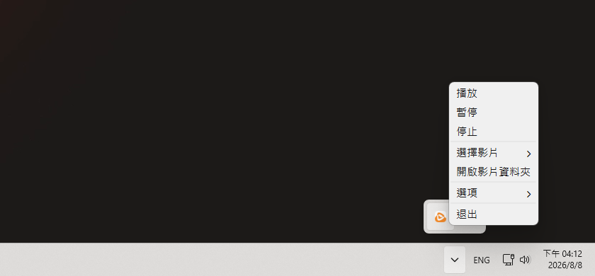

# BB 影片桌布

能在桌布撥放影片, 同時也是一個極輕量的桌布管理軟體  
將桌布保存在一個資料夾中, 以便隨時切換  

- 輕量 (~200MB)
- 可選各種自動暫停時機 (視窗最大化, 螢幕關閉, 沒插電)
- 可選開機自動啟動

### 截圖



# 下載

### 到 Releases 下載最新版

- [bb-video-wallpaper-setup.exe](https://github.com/BBeef/bb-video-wallpaper/releases)

# 使用

1. 開啟影片資料夾
2. 放影片到裡面
3. 選擇影片

# 想自己編譯?

## 需求

- [VLC](https://www.videolan.org/)

### 把 `VLC` 放在適當位置

```
bb-yt-downloader/
 ├─ icon/
 │   └─ bb-video-wallpaper.ico
 ├─ VLC/
 │   ├─ plugins/
 │   ├─ libvlc.dll
 │   ├─ libvlccore.dll
 │   └─ ...
 ├─ bb-video-wallpaper.py
 ├─ libvlc.dll
 └─ requirements.txt
```

## 執行

```bash
py -m venv .venv
.\.venv\Scripts\Activate.ps1
pip install -r requirements.txt
```
```bash
pyinstaller --noconfirm --onedir --noconsole --uac-admin --icon=icon/bb-video-wallpaper.ico --name="BB Video Wallpaper" --add-data "icon;icon" bb-video-wallpaper.py
```

打包後會在 `./dist`,  
然後將 `VLC/`, `libvlc.dll` 放在 .exe 旁邊  
像是這樣:  

```
Folder/
 ├─ _internal/
 │   └─ ...
 ├─ VLC/
 │   ├─ plugins/
 │   ├─ libvlc.dll
 │   ├─ libvlccore.dll
 │   └─ ...
 ├─ BB Video Wallpaper.exe
 └─ libvlc.dll
```

# VLC

`bb-video-wallpaper-setup.exe` 內含經刪減的 **VLC 3.0.23** , 僅保留 BB 影片桌布 播放影片所需的元件  
VLC 為開源軟體, 相關版權與授權資訊請參閱 `安裝目錄/VLC/` 中的 VLC 授權文件

# 版權

BB 影片桌布 採用 MIT License  
軟體內含的 VLC 3.0.23 相關元件依 VLC 所適用的授權條款提供  